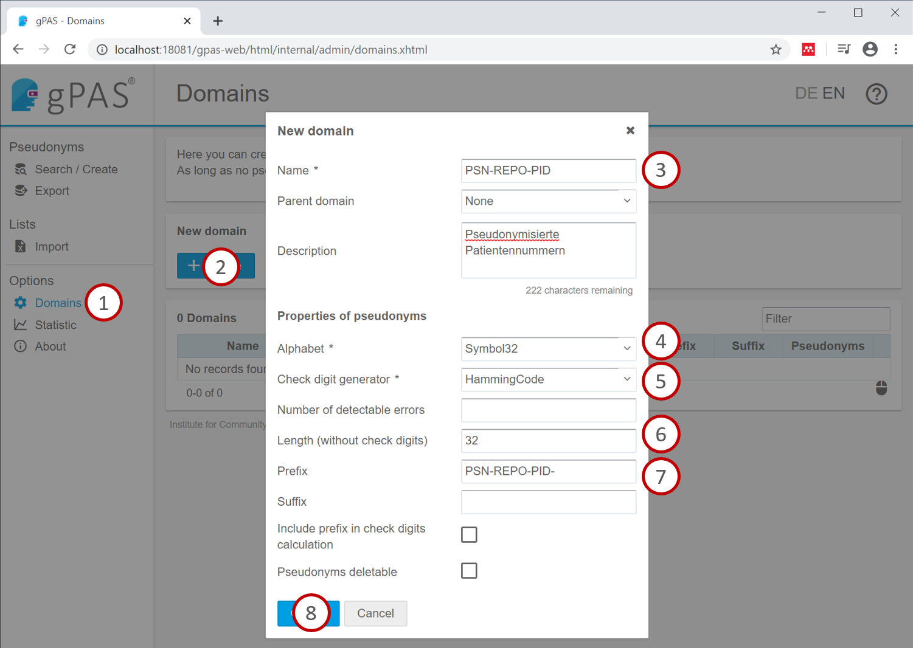

# FHIR Gateway

A thin layer between FHIR REST clients and resource processing pipelines.

## Overview


## Run it

Find the version tag of the latest release here: <https://gitlab.miracum.org/miracum/etl/fhir-gateway/-/releases> and set the IMAGE_TAG environment var to this version:

```sh
export IMAGE_TAG=v1.2.6 # may no longer be the most recent version...
```

Start the compose:

```sh
docker-compose -f deploy/docker-compose.yml up
```

This starts the gateway (<http://localhost:18080/fhir>), the LOINC conversion service, a PostgreSQL DB storing the received FHIR resources (<localhost:15432>), and a GPAS pseudonymization service (<http://localhost:18081/gpas-web>).

Before it will work, you'll need to setup a GPAS domain. To do so, visit <http://localhost:18081/gpas-web> and create a domain called `TEST`:



You can now start sending FHIR resources to <http://localhost:18080/fhir>, e.g.

```sh
curl -d @tests/e2e/data/observation.json -H "Content-Type: application/json" -X POST http://localhost:18080/fhir/Observation
```

To configure your deployment, you can change the following environment variables:

| Variable                               | Description                                                                                    | Default                                   |
| -------------------------------------- | ---------------------------------------------------------------------------------------------- | ----------------------------------------- |
| SPRING_DATASOURCE_URL                  | JDBC url of the Postgres DB to store the received FHIR resources                               | postgresql://fhir-db:5432/fhir            |
| SPRING_DATASOURCE_USERNAME             | Username of the Postgres DB                                                                    | postgres                                  |
| SPRING_DATASOURCE_PASSWORD             | Password for the Postgres DB                                                                   | postgres                                  |
| SERVICES_GPAS_API_URL                  | URL of the GPAS service                                                                        | <http://gpas:8080/gpas/gpasService?wsdl>  |
| SERVICES_GPAS_DOMAINS_PATIENT          | GPAS domain for Patient IDs                                                                    | TEST                                      |
| SERVICES_GPAS_DOMAINS_CASE             | GPAS domain for Encounter IDs                                                                  | TEST                                      |
| SERVICES_GPAS_DOMAINS_REPORT           | GPAS domain for DiagnosticReport IDs                                                           | TEST                                      |
| SERVICES_LOINC_CONVERSIONS_URL         | URL of [the LOINC conversion service](https://gitlab.miracum.org/miracum/etl/loinc-conversion) | <http://loinc-converter:8080/conversions> |
| SERVICES_LOINC_CONVERSIONS_HEALTHCHECK | URL of the LOINC conversion healthcheck endpoint                                               | <http://loinc-converter:8080/health>      |
